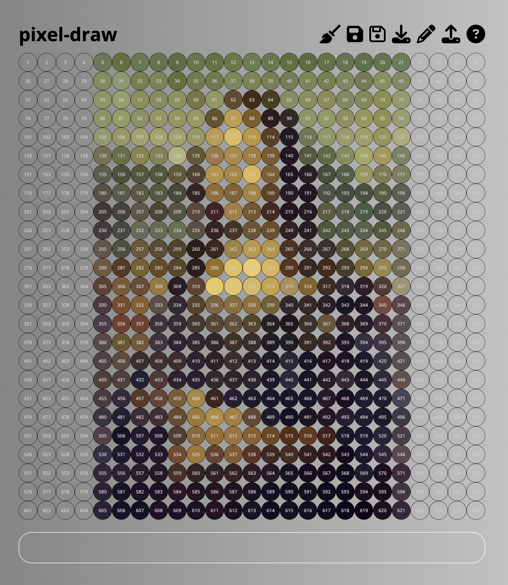

# pixel-draw

Small, single-page pixel art tool built with vanilla HTML/CSS/JS.

## Features

- 25x25 pixel grid drawing
- Click/drag to draw, Command-click/drag to erase
- Save/load to localStorage
- Export selected pixel IDs to a text box
- Paste pixel IDs to redraw a pattern
- Upload an image to auto-pixelate it into the grid

## Getting started

1. Open `index.html` in a browser.
2. Draw on the grid or upload an image to pixelate.
3. Use the toolbar icons for save/load/export.

## Controls

- Draw: click or click-drag
- Erase: hold Command while clicking/dragging
- Clear: broom icon
- Save: solid disk icon
- Load: outlined disk icon
- Export pixel IDs: download icon
- Draw from IDs: pencil icon (or paste into the textarea)
- Upload image: upload icon
- Help: question mark icon

## Project structure

- `index.html` app shell and toolbar
- `styles.css` layout and styling
- `scripts.js` grid logic, storage, and image pixelation

\*README generated using Codex
